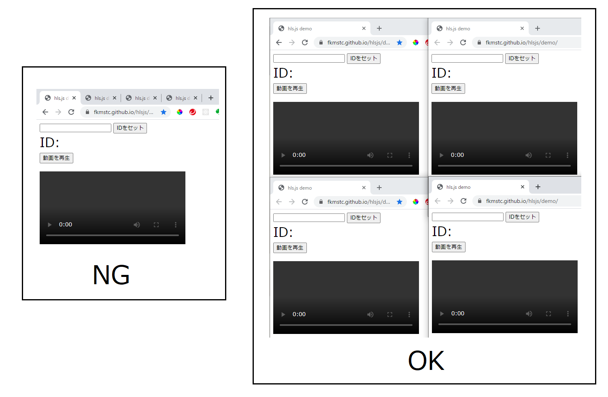
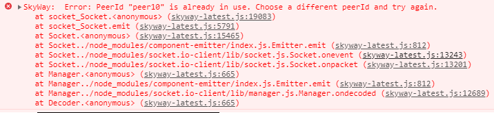

# P2Pで著作権管理可能な動画配信システム([デモサイト](https://fkmstc.github.io/hlsjs/demo/))
一応このサイトでドキュメント化を行いたいと思います。  
以下に使用ライブラリのDocを貼ります。  
具体的な仕様については、そちらを参照するとより理解ができるかと思われます。  
* 使用ライブラリ
    * [hls.js](https://github.com/video-dev/hls.js/)
    * [SkyWay](https://webrtc.ecl.ntt.com/api-reference/javascript.html)

* その他 自作のコード
    * [editHLSjs.js](./demo/js/editHLSjs.js)　(主にチャンク、プレイリストの操作を行っているJsファイル)
    * [skywayEdit.js](./demo/js/skywayEdit.js)　（主にピアの接続、チャンクのダウンロードを行っているファイル） 
  

## 操作方法
* サイトを開きます。  
この時、**タブ**ではなく**ウインドウ**で開いてください。  
(ページが最前面にないとバックグラウンドの処理ができません。)  

 

* IDをセットします。  
デモではpeer10,peer11,peer12,peer13を入力してください。  
peer13は恐らく最後に値をセットしないと、正常に動作しないと思われます。  
（他のピアからチャンクを取得するピアの為。)
 
下記のようなエラーが出た場合、一度時間をおいてからリロードしてください。  
(既に他のページで入力したpeerIDが使用されている可能性があります。ご確認ください。)  

   
動画が再生されれば成功です。  

## 解説
まず、基本動作について解説します。  

### hls.js
[![](https://mermaid.ink/img/eyJjb2RlIjoic2VxdWVuY2VEaWFncmFtXG5cdFx0SExTLmpzLT4-U2VydmVyOiDjg5fjg6zjgqTjg6rjgrnjg4jjgpLopoHmsYJcblx0XHRTZXJ2ZXItLT4-SExTLmpzOiDjg5fjg6zjgqTjg6rjgrnjg4jjgpLlj5blvpdcblx0XHRITFMuanMtPj5ITFMuanM6IOODl-ODrOOCpOODquOCueODiOOCkuino-aekFxuXHRcdGxvb3Ag44OB44Oj44Oz44Kv44GM44Gq44GP44Gq44KL44G-44GnXG5cdFx0SExTLmpzLT4-U2VydmVyOiDjg4Hjg6Pjg7Pjgq_jgpLopoHmsYJcblx0XHRTZXJ2ZXItLT4-SExTLmpzOiDjg4Hjg6Pjg7Pjgq_jgpLlj5blvpdcblx0XHRITFMuanMtPj5ITFMuanM6IOWPl-OBkeWPluOBo-OBn-ODgeODo-ODs-OCr-OCkjxicj5idWZmZXLjgavmoLzntI1cblx0XHRlbmQiLCJtZXJtYWlkIjp7InRoZW1lIjoiZGVmYXVsdCIsInRoZW1lVmFyaWFibGVzIjp7ImJhY2tncm91bmQiOiJ3aGl0ZSIsInByaW1hcnlDb2xvciI6IiNFQ0VDRkYiLCJzZWNvbmRhcnlDb2xvciI6IiNmZmZmZGUiLCJ0ZXJ0aWFyeUNvbG9yIjoiaHNsKDgwLCAxMDAlLCA5Ni4yNzQ1MDk4MDM5JSkiLCJwcmltYXJ5Qm9yZGVyQ29sb3IiOiJoc2woMjQwLCA2MCUsIDg2LjI3NDUwOTgwMzklKSIsInNlY29uZGFyeUJvcmRlckNvbG9yIjoiaHNsKDYwLCA2MCUsIDgzLjUyOTQxMTc2NDclKSIsInRlcnRpYXJ5Qm9yZGVyQ29sb3IiOiJoc2woODAsIDYwJSwgODYuMjc0NTA5ODAzOSUpIiwicHJpbWFyeVRleHRDb2xvciI6IiMxMzEzMDAiLCJzZWNvbmRhcnlUZXh0Q29sb3IiOiIjMDAwMDIxIiwidGVydGlhcnlUZXh0Q29sb3IiOiJyZ2IoOS41MDAwMDAwMDAxLCA5LjUwMDAwMDAwMDEsIDkuNTAwMDAwMDAwMSkiLCJsaW5lQ29sb3IiOiIjMzMzMzMzIiwidGV4dENvbG9yIjoiIzMzMyIsIm1haW5Ca2ciOiIjRUNFQ0ZGIiwic2Vjb25kQmtnIjoiI2ZmZmZkZSIsImJvcmRlcjEiOiIjOTM3MERCIiwiYm9yZGVyMiI6IiNhYWFhMzMiLCJhcnJvd2hlYWRDb2xvciI6IiMzMzMzMzMiLCJmb250RmFtaWx5IjoiXCJ0cmVidWNoZXQgbXNcIiwgdmVyZGFuYSwgYXJpYWwiLCJmb250U2l6ZSI6IjE2cHgiLCJsYWJlbEJhY2tncm91bmQiOiIjZThlOGU4Iiwibm9kZUJrZyI6IiNFQ0VDRkYiLCJub2RlQm9yZGVyIjoiIzkzNzBEQiIsImNsdXN0ZXJCa2ciOiIjZmZmZmRlIiwiY2x1c3RlckJvcmRlciI6IiNhYWFhMzMiLCJkZWZhdWx0TGlua0NvbG9yIjoiIzMzMzMzMyIsInRpdGxlQ29sb3IiOiIjMzMzIiwiZWRnZUxhYmVsQmFja2dyb3VuZCI6IiNlOGU4ZTgiLCJhY3RvckJvcmRlciI6ImhzbCgyNTkuNjI2MTY4MjI0MywgNTkuNzc2NTM2MzEyOCUsIDg3LjkwMTk2MDc4NDMlKSIsImFjdG9yQmtnIjoiI0VDRUNGRiIsImFjdG9yVGV4dENvbG9yIjoiYmxhY2siLCJhY3RvckxpbmVDb2xvciI6ImdyZXkiLCJzaWduYWxDb2xvciI6IiMzMzMiLCJzaWduYWxUZXh0Q29sb3IiOiIjMzMzIiwibGFiZWxCb3hCa2dDb2xvciI6IiNFQ0VDRkYiLCJsYWJlbEJveEJvcmRlckNvbG9yIjoiaHNsKDI1OS42MjYxNjgyMjQzLCA1OS43NzY1MzYzMTI4JSwgODcuOTAxOTYwNzg0MyUpIiwibGFiZWxUZXh0Q29sb3IiOiJibGFjayIsImxvb3BUZXh0Q29sb3IiOiJibGFjayIsIm5vdGVCb3JkZXJDb2xvciI6IiNhYWFhMzMiLCJub3RlQmtnQ29sb3IiOiIjZmZmNWFkIiwibm90ZVRleHRDb2xvciI6ImJsYWNrIiwiYWN0aXZhdGlvbkJvcmRlckNvbG9yIjoiIzY2NiIsImFjdGl2YXRpb25Ca2dDb2xvciI6IiNmNGY0ZjQiLCJzZXF1ZW5jZU51bWJlckNvbG9yIjoid2hpdGUiLCJzZWN0aW9uQmtnQ29sb3IiOiJyZ2JhKDEwMiwgMTAyLCAyNTUsIDAuNDkpIiwiYWx0U2VjdGlvbkJrZ0NvbG9yIjoid2hpdGUiLCJzZWN0aW9uQmtnQ29sb3IyIjoiI2ZmZjQwMCIsInRhc2tCb3JkZXJDb2xvciI6IiM1MzRmYmMiLCJ0YXNrQmtnQ29sb3IiOiIjOGE5MGRkIiwidGFza1RleHRMaWdodENvbG9yIjoid2hpdGUiLCJ0YXNrVGV4dENvbG9yIjoid2hpdGUiLCJ0YXNrVGV4dERhcmtDb2xvciI6ImJsYWNrIiwidGFza1RleHRPdXRzaWRlQ29sb3IiOiJibGFjayIsInRhc2tUZXh0Q2xpY2thYmxlQ29sb3IiOiIjMDAzMTYzIiwiYWN0aXZlVGFza0JvcmRlckNvbG9yIjoiIzUzNGZiYyIsImFjdGl2ZVRhc2tCa2dDb2xvciI6IiNiZmM3ZmYiLCJncmlkQ29sb3IiOiJsaWdodGdyZXkiLCJkb25lVGFza0JrZ0NvbG9yIjoibGlnaHRncmV5IiwiZG9uZVRhc2tCb3JkZXJDb2xvciI6ImdyZXkiLCJjcml0Qm9yZGVyQ29sb3IiOiIjZmY4ODg4IiwiY3JpdEJrZ0NvbG9yIjoicmVkIiwidG9kYXlMaW5lQ29sb3IiOiJyZWQiLCJsYWJlbENvbG9yIjoiYmxhY2siLCJlcnJvckJrZ0NvbG9yIjoiIzU1MjIyMiIsImVycm9yVGV4dENvbG9yIjoiIzU1MjIyMiIsImNsYXNzVGV4dCI6IiMxMzEzMDAiLCJmaWxsVHlwZTAiOiIjRUNFQ0ZGIiwiZmlsbFR5cGUxIjoiI2ZmZmZkZSIsImZpbGxUeXBlMiI6ImhzbCgzMDQsIDEwMCUsIDk2LjI3NDUwOTgwMzklKSIsImZpbGxUeXBlMyI6ImhzbCgxMjQsIDEwMCUsIDkzLjUyOTQxMTc2NDclKSIsImZpbGxUeXBlNCI6ImhzbCgxNzYsIDEwMCUsIDk2LjI3NDUwOTgwMzklKSIsImZpbGxUeXBlNSI6ImhzbCgtNCwgMTAwJSwgOTMuNTI5NDExNzY0NyUpIiwiZmlsbFR5cGU2IjoiaHNsKDgsIDEwMCUsIDk2LjI3NDUwOTgwMzklKSIsImZpbGxUeXBlNyI6ImhzbCgxODgsIDEwMCUsIDkzLjUyOTQxMTc2NDclKSJ9fX0)](https://mermaid-js.github.io/mermaid-live-editor/#/edit/eyJjb2RlIjoic2VxdWVuY2VEaWFncmFtXG5cdFx0SExTLmpzLT4-U2VydmVyOiDjg5fjg6zjgqTjg6rjgrnjg4jjgpLopoHmsYJcblx0XHRTZXJ2ZXItLT4-SExTLmpzOiDjg5fjg6zjgqTjg6rjgrnjg4jjgpLlj5blvpdcblx0XHRITFMuanMtPj5ITFMuanM6IOODl-ODrOOCpOODquOCueODiOOCkuino-aekFxuXHRcdGxvb3Ag44OB44Oj44Oz44Kv44GM44Gq44GP44Gq44KL44G-44GnXG5cdFx0SExTLmpzLT4-U2VydmVyOiDjg4Hjg6Pjg7Pjgq_jgpLopoHmsYJcblx0XHRTZXJ2ZXItLT4-SExTLmpzOiDjg4Hjg6Pjg7Pjgq_jgpLlj5blvpdcblx0XHRITFMuanMtPj5ITFMuanM6IOWPl-OBkeWPluOBo-OBn-ODgeODo-ODs-OCr-OCkjxicj5idWZmZXLjgavmoLzntI1cblx0XHRlbmQiLCJtZXJtYWlkIjp7InRoZW1lIjoiZGVmYXVsdCIsInRoZW1lVmFyaWFibGVzIjp7ImJhY2tncm91bmQiOiJ3aGl0ZSIsInByaW1hcnlDb2xvciI6IiNFQ0VDRkYiLCJzZWNvbmRhcnlDb2xvciI6IiNmZmZmZGUiLCJ0ZXJ0aWFyeUNvbG9yIjoiaHNsKDgwLCAxMDAlLCA5Ni4yNzQ1MDk4MDM5JSkiLCJwcmltYXJ5Qm9yZGVyQ29sb3IiOiJoc2woMjQwLCA2MCUsIDg2LjI3NDUwOTgwMzklKSIsInNlY29uZGFyeUJvcmRlckNvbG9yIjoiaHNsKDYwLCA2MCUsIDgzLjUyOTQxMTc2NDclKSIsInRlcnRpYXJ5Qm9yZGVyQ29sb3IiOiJoc2woODAsIDYwJSwgODYuMjc0NTA5ODAzOSUpIiwicHJpbWFyeVRleHRDb2xvciI6IiMxMzEzMDAiLCJzZWNvbmRhcnlUZXh0Q29sb3IiOiIjMDAwMDIxIiwidGVydGlhcnlUZXh0Q29sb3IiOiJyZ2IoOS41MDAwMDAwMDAxLCA5LjUwMDAwMDAwMDEsIDkuNTAwMDAwMDAwMSkiLCJsaW5lQ29sb3IiOiIjMzMzMzMzIiwidGV4dENvbG9yIjoiIzMzMyIsIm1haW5Ca2ciOiIjRUNFQ0ZGIiwic2Vjb25kQmtnIjoiI2ZmZmZkZSIsImJvcmRlcjEiOiIjOTM3MERCIiwiYm9yZGVyMiI6IiNhYWFhMzMiLCJhcnJvd2hlYWRDb2xvciI6IiMzMzMzMzMiLCJmb250RmFtaWx5IjoiXCJ0cmVidWNoZXQgbXNcIiwgdmVyZGFuYSwgYXJpYWwiLCJmb250U2l6ZSI6IjE2cHgiLCJsYWJlbEJhY2tncm91bmQiOiIjZThlOGU4Iiwibm9kZUJrZyI6IiNFQ0VDRkYiLCJub2RlQm9yZGVyIjoiIzkzNzBEQiIsImNsdXN0ZXJCa2ciOiIjZmZmZmRlIiwiY2x1c3RlckJvcmRlciI6IiNhYWFhMzMiLCJkZWZhdWx0TGlua0NvbG9yIjoiIzMzMzMzMyIsInRpdGxlQ29sb3IiOiIjMzMzIiwiZWRnZUxhYmVsQmFja2dyb3VuZCI6IiNlOGU4ZTgiLCJhY3RvckJvcmRlciI6ImhzbCgyNTkuNjI2MTY4MjI0MywgNTkuNzc2NTM2MzEyOCUsIDg3LjkwMTk2MDc4NDMlKSIsImFjdG9yQmtnIjoiI0VDRUNGRiIsImFjdG9yVGV4dENvbG9yIjoiYmxhY2siLCJhY3RvckxpbmVDb2xvciI6ImdyZXkiLCJzaWduYWxDb2xvciI6IiMzMzMiLCJzaWduYWxUZXh0Q29sb3IiOiIjMzMzIiwibGFiZWxCb3hCa2dDb2xvciI6IiNFQ0VDRkYiLCJsYWJlbEJveEJvcmRlckNvbG9yIjoiaHNsKDI1OS42MjYxNjgyMjQzLCA1OS43NzY1MzYzMTI4JSwgODcuOTAxOTYwNzg0MyUpIiwibGFiZWxUZXh0Q29sb3IiOiJibGFjayIsImxvb3BUZXh0Q29sb3IiOiJibGFjayIsIm5vdGVCb3JkZXJDb2xvciI6IiNhYWFhMzMiLCJub3RlQmtnQ29sb3IiOiIjZmZmNWFkIiwibm90ZVRleHRDb2xvciI6ImJsYWNrIiwiYWN0aXZhdGlvbkJvcmRlckNvbG9yIjoiIzY2NiIsImFjdGl2YXRpb25Ca2dDb2xvciI6IiNmNGY0ZjQiLCJzZXF1ZW5jZU51bWJlckNvbG9yIjoid2hpdGUiLCJzZWN0aW9uQmtnQ29sb3IiOiJyZ2JhKDEwMiwgMTAyLCAyNTUsIDAuNDkpIiwiYWx0U2VjdGlvbkJrZ0NvbG9yIjoid2hpdGUiLCJzZWN0aW9uQmtnQ29sb3IyIjoiI2ZmZjQwMCIsInRhc2tCb3JkZXJDb2xvciI6IiM1MzRmYmMiLCJ0YXNrQmtnQ29sb3IiOiIjOGE5MGRkIiwidGFza1RleHRMaWdodENvbG9yIjoid2hpdGUiLCJ0YXNrVGV4dENvbG9yIjoid2hpdGUiLCJ0YXNrVGV4dERhcmtDb2xvciI6ImJsYWNrIiwidGFza1RleHRPdXRzaWRlQ29sb3IiOiJibGFjayIsInRhc2tUZXh0Q2xpY2thYmxlQ29sb3IiOiIjMDAzMTYzIiwiYWN0aXZlVGFza0JvcmRlckNvbG9yIjoiIzUzNGZiYyIsImFjdGl2ZVRhc2tCa2dDb2xvciI6IiNiZmM3ZmYiLCJncmlkQ29sb3IiOiJsaWdodGdyZXkiLCJkb25lVGFza0JrZ0NvbG9yIjoibGlnaHRncmV5IiwiZG9uZVRhc2tCb3JkZXJDb2xvciI6ImdyZXkiLCJjcml0Qm9yZGVyQ29sb3IiOiIjZmY4ODg4IiwiY3JpdEJrZ0NvbG9yIjoicmVkIiwidG9kYXlMaW5lQ29sb3IiOiJyZWQiLCJsYWJlbENvbG9yIjoiYmxhY2siLCJlcnJvckJrZ0NvbG9yIjoiIzU1MjIyMiIsImVycm9yVGV4dENvbG9yIjoiIzU1MjIyMiIsImNsYXNzVGV4dCI6IiMxMzEzMDAiLCJmaWxsVHlwZTAiOiIjRUNFQ0ZGIiwiZmlsbFR5cGUxIjoiI2ZmZmZkZSIsImZpbGxUeXBlMiI6ImhzbCgzMDQsIDEwMCUsIDk2LjI3NDUwOTgwMzklKSIsImZpbGxUeXBlMyI6ImhzbCgxMjQsIDEwMCUsIDkzLjUyOTQxMTc2NDclKSIsImZpbGxUeXBlNCI6ImhzbCgxNzYsIDEwMCUsIDk2LjI3NDUwOTgwMzklKSIsImZpbGxUeXBlNSI6ImhzbCgtNCwgMTAwJSwgOTMuNTI5NDExNzY0NyUpIiwiZmlsbFR5cGU2IjoiaHNsKDgsIDEwMCUsIDk2LjI3NDUwOTgwMzklKSIsImZpbGxUeXBlNyI6ImhzbCgxODgsIDEwMCUsIDkzLjUyOTQxMTc2NDclKSJ9fX0)  
hls.jsは始めにプレイリスト(m3u8ファイル)を取得しに来ます。  
その後、そのプレイリストをもとにサーバから動画をダウンロード、バッファに格納していきます。  

hls.jsの導入は簡単で、[Doc](https://github.com/video-dev/hls.js/blob/master/docs/API.md#first-step-setup-and-support)や[公式のGitHubのページ](https://github.com/video-dev/hls.js#getting-started)を参照すれば比較的簡単に導入できます。  
対応するコードは[この部分](./demo/js/editHLSjs.js#L81-L89)になります。  
特記する点は無いですが、後述する「チャンクの受信先を動的に変更する」機能を設定（オーバーライド）するのは、[ここ](https://github.com/fkmstc/fkmstc.github.io/blob/master/hlsjs/demo/js/editHLSjs.js#L84)で割り当てられています。  
 
hls.jsにはチューニング機能として、ライブラリの一部機能を上書き(オーバーライド)[出来ます](https://github.com/video-dev/hls.js/blob/master/docs/API.md#fine-tuning)。  
その中の[loader](https://github.com/video-dev/hls.js/blob/master/docs/API.md#loader)や[pLoader](https://github.com/video-dev/hls.js/blob/master/docs/API.md#ploader)を参考に実現しています。

### SkyWay
SkyWayの導入も[CDN](https://webrtc.ecl.ntt.com/documents/javascript-sdk.html#cdn%E3%82%92%E5%88%A9%E7%94%A8%E3%81%99%E3%82%8B%E5%A0%B4%E5%90%88)を使えば簡単に行えます。  
初めに[Peerと呼ばれるインスタンス](https://webrtc.ecl.ntt.com/documents/javascript-sdk.html#_2-%E3%82%A2%E3%83%97%E3%83%AA%E3%82%B1%E3%83%BC%E3%82%B7%E3%83%A7%E3%83%B3%E3%81%AE%E4%BD%9C%E6%88%90)を[この部分で](https://github.com/fkmstc/fkmstc.github.io/blob/master/hlsjs/demo/index.html#L51)作成しておきます。  
また、正常にシグナリングサーバに接続できたときの[イベント](https://webrtc.ecl.ntt.com/api-reference/javascript.html#events)を用い、hls.jsの機能を[ここ](https://github.com/fkmstc/fkmstc.github.io/blob/master/hlsjs/demo/index.html#L62)でオーバーライドしています。

## フローチャートと各関数の説明
### サーバ編
[![](https://mermaid.ink/img/eyJjb2RlIjoic2VxdWVuY2VEaWFncmFtXG5cdFx0cGVlcjEwLT4-U2VydmVyOiDjg5fjg6zjgqTjg6rjgrnjg4jjgpLopoHmsYJcblx0XHRTZXJ2ZXItLT4-cGVlcjEwOiDjg5fjg6zjgqTjg6rjgrnjg4jjgpLlj5blvpdcblx0XHRwZWVyMTAtPj5wZWVyMTA6IOODl-ODrOOCpOODquOCueODiOOCkuino-aekFxuXHRcdHBlZXIxMC0-PlNlcnZlcjogSlNPTuODleOCoeOCpOODq-OCkuimgeaxglxuXHRcdFNlcnZlci0tPj5wZWVyMTA6IEpTT07jg5XjgqHjgqTjg6vjgpLlj5blvpdcblx0XHROb3RlIGxlZnQgb2YgcGVlcjEwIDogXCJVUkxcIjpcIlNlcnZlclwiPGJyPlwidHNGaWxlTmFtZVwiOiBcIlRzMDAxLnRzXCI8YnI-XCJkaXJOYW1lXCI6XCJQbGF5TGlzdDFcIlxuXHRcdGxvb3Ag44OB44Oj44Oz44Kv44GM44Gq44GP44Gq44KL44G-44GnXG5cdFx0cGVlcjEwLT4-cGVlcjEwOiBKU09O44OV44Kh44Kk44Or44KS44KC44Go44GrPGJyPuODgeODo-ODs-OCr-OBrlVSTOOCkuWkieabtFxuXHRcdGFsdCBKU09OW1VSTF0gaXMgU2VydmVyXG5cdFx0Tm90ZSBsZWZ0IG9mIHBlZXIxMCA6IFwiLi9UczAwMS50c1wiPGJyPuKGkzxicj5cIi4vUGxheUxpc3QxL1RzMDAxLnRzXCJcblx0XHRwZWVyMTAtPj5TZXJ2ZXI6IOODgeODo-ODs-OCr-OCkuimgeaxglxuXHRcdFNlcnZlci0tPj5wZWVyMTA6IOODgeODo-ODs-OCr-OCkuWPluW-l1xuXHRcdGVsc2UgZWxzZVxuXHRcdHBlZXIxMC0-PnBlZXIxMzog44OB44Oj44Oz44Kv44KS6KaB5rGCXG5cdFx0cGVlcjEzLT4-cGVlcjEzOiBidWZmZXLjgYvjgonjg4Hjg6Pjg7Pjgq_jgpI8YnI-5Y-W44KK5Ye644GXXG5cdFx0cGVlcjEzLS0-PnBlZXIxMDog44OB44Oj44Oz44Kv44KS5Y-W5b6X77yI44OQ44Kk44OK44Oq44OH44O844K_77yJXG5cdFx0cGVlcjEwLT4-cGVlcjEwOiBjcmVhdGVPYmplY3RVUkzjgadVUkzjgpLnmbrooYxcblx0XHRwZWVyMTAtPj5wZWVyMTA6IOODgeODo-ODs-OCr-OCkuimgeaxgiBhbmQg5Y-W5b6XXG5cdFx0ZW5kXG5cdFx0cGVlcjEwLT4-cGVlcjEwOiDlj5fjgZHlj5bjgaPjgZ_jg4Hjg6Pjg7Pjgq_jgpI8YnI-YnVmZmVy44Gr5qC857SNXG5cdFx0ZW5kIiwibWVybWFpZCI6eyJ0aGVtZSI6ImRlZmF1bHQiLCJ0aGVtZVZhcmlhYmxlcyI6eyJiYWNrZ3JvdW5kIjoid2hpdGUiLCJwcmltYXJ5Q29sb3IiOiIjRUNFQ0ZGIiwic2Vjb25kYXJ5Q29sb3IiOiIjZmZmZmRlIiwidGVydGlhcnlDb2xvciI6ImhzbCg4MCwgMTAwJSwgOTYuMjc0NTA5ODAzOSUpIiwicHJpbWFyeUJvcmRlckNvbG9yIjoiaHNsKDI0MCwgNjAlLCA4Ni4yNzQ1MDk4MDM5JSkiLCJzZWNvbmRhcnlCb3JkZXJDb2xvciI6ImhzbCg2MCwgNjAlLCA4My41Mjk0MTE3NjQ3JSkiLCJ0ZXJ0aWFyeUJvcmRlckNvbG9yIjoiaHNsKDgwLCA2MCUsIDg2LjI3NDUwOTgwMzklKSIsInByaW1hcnlUZXh0Q29sb3IiOiIjMTMxMzAwIiwic2Vjb25kYXJ5VGV4dENvbG9yIjoiIzAwMDAyMSIsInRlcnRpYXJ5VGV4dENvbG9yIjoicmdiKDkuNTAwMDAwMDAwMSwgOS41MDAwMDAwMDAxLCA5LjUwMDAwMDAwMDEpIiwibGluZUNvbG9yIjoiIzMzMzMzMyIsInRleHRDb2xvciI6IiMzMzMiLCJtYWluQmtnIjoiI0VDRUNGRiIsInNlY29uZEJrZyI6IiNmZmZmZGUiLCJib3JkZXIxIjoiIzkzNzBEQiIsImJvcmRlcjIiOiIjYWFhYTMzIiwiYXJyb3doZWFkQ29sb3IiOiIjMzMzMzMzIiwiZm9udEZhbWlseSI6IlwidHJlYnVjaGV0IG1zXCIsIHZlcmRhbmEsIGFyaWFsIiwiZm9udFNpemUiOiIxNnB4IiwibGFiZWxCYWNrZ3JvdW5kIjoiI2U4ZThlOCIsIm5vZGVCa2ciOiIjRUNFQ0ZGIiwibm9kZUJvcmRlciI6IiM5MzcwREIiLCJjbHVzdGVyQmtnIjoiI2ZmZmZkZSIsImNsdXN0ZXJCb3JkZXIiOiIjYWFhYTMzIiwiZGVmYXVsdExpbmtDb2xvciI6IiMzMzMzMzMiLCJ0aXRsZUNvbG9yIjoiIzMzMyIsImVkZ2VMYWJlbEJhY2tncm91bmQiOiIjZThlOGU4IiwiYWN0b3JCb3JkZXIiOiJoc2woMjU5LjYyNjE2ODIyNDMsIDU5Ljc3NjUzNjMxMjglLCA4Ny45MDE5NjA3ODQzJSkiLCJhY3RvckJrZyI6IiNFQ0VDRkYiLCJhY3RvclRleHRDb2xvciI6ImJsYWNrIiwiYWN0b3JMaW5lQ29sb3IiOiJncmV5Iiwic2lnbmFsQ29sb3IiOiIjMzMzIiwic2lnbmFsVGV4dENvbG9yIjoiIzMzMyIsImxhYmVsQm94QmtnQ29sb3IiOiIjRUNFQ0ZGIiwibGFiZWxCb3hCb3JkZXJDb2xvciI6ImhzbCgyNTkuNjI2MTY4MjI0MywgNTkuNzc2NTM2MzEyOCUsIDg3LjkwMTk2MDc4NDMlKSIsImxhYmVsVGV4dENvbG9yIjoiYmxhY2siLCJsb29wVGV4dENvbG9yIjoiYmxhY2siLCJub3RlQm9yZGVyQ29sb3IiOiIjYWFhYTMzIiwibm90ZUJrZ0NvbG9yIjoiI2ZmZjVhZCIsIm5vdGVUZXh0Q29sb3IiOiJibGFjayIsImFjdGl2YXRpb25Cb3JkZXJDb2xvciI6IiM2NjYiLCJhY3RpdmF0aW9uQmtnQ29sb3IiOiIjZjRmNGY0Iiwic2VxdWVuY2VOdW1iZXJDb2xvciI6IndoaXRlIiwic2VjdGlvbkJrZ0NvbG9yIjoicmdiYSgxMDIsIDEwMiwgMjU1LCAwLjQ5KSIsImFsdFNlY3Rpb25Ca2dDb2xvciI6IndoaXRlIiwic2VjdGlvbkJrZ0NvbG9yMiI6IiNmZmY0MDAiLCJ0YXNrQm9yZGVyQ29sb3IiOiIjNTM0ZmJjIiwidGFza0JrZ0NvbG9yIjoiIzhhOTBkZCIsInRhc2tUZXh0TGlnaHRDb2xvciI6IndoaXRlIiwidGFza1RleHRDb2xvciI6IndoaXRlIiwidGFza1RleHREYXJrQ29sb3IiOiJibGFjayIsInRhc2tUZXh0T3V0c2lkZUNvbG9yIjoiYmxhY2siLCJ0YXNrVGV4dENsaWNrYWJsZUNvbG9yIjoiIzAwMzE2MyIsImFjdGl2ZVRhc2tCb3JkZXJDb2xvciI6IiM1MzRmYmMiLCJhY3RpdmVUYXNrQmtnQ29sb3IiOiIjYmZjN2ZmIiwiZ3JpZENvbG9yIjoibGlnaHRncmV5IiwiZG9uZVRhc2tCa2dDb2xvciI6ImxpZ2h0Z3JleSIsImRvbmVUYXNrQm9yZGVyQ29sb3IiOiJncmV5IiwiY3JpdEJvcmRlckNvbG9yIjoiI2ZmODg4OCIsImNyaXRCa2dDb2xvciI6InJlZCIsInRvZGF5TGluZUNvbG9yIjoicmVkIiwibGFiZWxDb2xvciI6ImJsYWNrIiwiZXJyb3JCa2dDb2xvciI6IiM1NTIyMjIiLCJlcnJvclRleHRDb2xvciI6IiM1NTIyMjIiLCJjbGFzc1RleHQiOiIjMTMxMzAwIiwiZmlsbFR5cGUwIjoiI0VDRUNGRiIsImZpbGxUeXBlMSI6IiNmZmZmZGUiLCJmaWxsVHlwZTIiOiJoc2woMzA0LCAxMDAlLCA5Ni4yNzQ1MDk4MDM5JSkiLCJmaWxsVHlwZTMiOiJoc2woMTI0LCAxMDAlLCA5My41Mjk0MTE3NjQ3JSkiLCJmaWxsVHlwZTQiOiJoc2woMTc2LCAxMDAlLCA5Ni4yNzQ1MDk4MDM5JSkiLCJmaWxsVHlwZTUiOiJoc2woLTQsIDEwMCUsIDkzLjUyOTQxMTc2NDclKSIsImZpbGxUeXBlNiI6ImhzbCg4LCAxMDAlLCA5Ni4yNzQ1MDk4MDM5JSkiLCJmaWxsVHlwZTciOiJoc2woMTg4LCAxMDAlLCA5My41Mjk0MTE3NjQ3JSkifX0sInVwZGF0ZUVkaXRvciI6ZmFsc2V9)](https://mermaid-js.github.io/mermaid-live-editor/#/edit/eyJjb2RlIjoic2VxdWVuY2VEaWFncmFtXG5cdFx0cGVlcjEwLT4-U2VydmVyOiDjg5fjg6zjgqTjg6rjgrnjg4jjgpLopoHmsYJcblx0XHRTZXJ2ZXItLT4-cGVlcjEwOiDjg5fjg6zjgqTjg6rjgrnjg4jjgpLlj5blvpdcblx0XHRwZWVyMTAtPj5wZWVyMTA6IOODl-ODrOOCpOODquOCueODiOOCkuino-aekFxuXHRcdHBlZXIxMC0-PlNlcnZlcjogSlNPTuODleOCoeOCpOODq-OCkuimgeaxglxuXHRcdFNlcnZlci0tPj5wZWVyMTA6IEpTT07jg5XjgqHjgqTjg6vjgpLlj5blvpdcblx0XHROb3RlIGxlZnQgb2YgcGVlcjEwIDogXCJVUkxcIjpcIlNlcnZlclwiPGJyPlwidHNGaWxlTmFtZVwiOiBcIlRzMDAxLnRzXCI8YnI-XCJkaXJOYW1lXCI6XCJQbGF5TGlzdDFcIlxuXHRcdGxvb3Ag44OB44Oj44Oz44Kv44GM44Gq44GP44Gq44KL44G-44GnXG5cdFx0cGVlcjEwLT4-cGVlcjEwOiBKU09O44OV44Kh44Kk44Or44KS44KC44Go44GrPGJyPuODgeODo-ODs-OCr-OBrlVSTOOCkuWkieabtFxuXHRcdGFsdCBKU09OW1VSTF0gaXMgU2VydmVyXG5cdFx0Tm90ZSBsZWZ0IG9mIHBlZXIxMCA6IFwiLi9UczAwMS50c1wiPGJyPuKGkzxicj5cIi4vUGxheUxpc3QxL1RzMDAxLnRzXCJcblx0XHRwZWVyMTAtPj5TZXJ2ZXI6IOODgeODo-ODs-OCr-OCkuimgeaxglxuXHRcdFNlcnZlci0tPj5wZWVyMTA6IOODgeODo-ODs-OCr-OCkuWPluW-l1xuXHRcdGVsc2UgZWxzZVxuXHRcdHBlZXIxMC0-PnBlZXIxMzog44OB44Oj44Oz44Kv44KS6KaB5rGCXG5cdFx0cGVlcjEzLT4-cGVlcjEzOiBidWZmZXLjgYvjgonjg4Hjg6Pjg7Pjgq_jgpI8YnI-5Y-W44KK5Ye644GXXG5cdFx0cGVlcjEzLS0-PnBlZXIxMDog44OB44Oj44Oz44Kv44KS5Y-W5b6X77yI44OQ44Kk44OK44Oq44OH44O844K_77yJXG5cdFx0cGVlcjEwLT4-cGVlcjEwOiBjcmVhdGVPYmplY3RVUkzjgadVUkzjgpLnmbrooYxcblx0XHRwZWVyMTAtPj5wZWVyMTA6IOODgeODo-ODs-OCr-OCkuimgeaxgiBhbmQg5Y-W5b6XXG5cdFx0ZW5kXG5cdFx0cGVlcjEwLT4-cGVlcjEwOiDlj5fjgZHlj5bjgaPjgZ_jg4Hjg6Pjg7Pjgq_jgpI8YnI-YnVmZmVy44Gr5qC857SNXG5cdFx0ZW5kIiwibWVybWFpZCI6eyJ0aGVtZSI6ImRlZmF1bHQiLCJ0aGVtZVZhcmlhYmxlcyI6eyJiYWNrZ3JvdW5kIjoid2hpdGUiLCJwcmltYXJ5Q29sb3IiOiIjRUNFQ0ZGIiwic2Vjb25kYXJ5Q29sb3IiOiIjZmZmZmRlIiwidGVydGlhcnlDb2xvciI6ImhzbCg4MCwgMTAwJSwgOTYuMjc0NTA5ODAzOSUpIiwicHJpbWFyeUJvcmRlckNvbG9yIjoiaHNsKDI0MCwgNjAlLCA4Ni4yNzQ1MDk4MDM5JSkiLCJzZWNvbmRhcnlCb3JkZXJDb2xvciI6ImhzbCg2MCwgNjAlLCA4My41Mjk0MTE3NjQ3JSkiLCJ0ZXJ0aWFyeUJvcmRlckNvbG9yIjoiaHNsKDgwLCA2MCUsIDg2LjI3NDUwOTgwMzklKSIsInByaW1hcnlUZXh0Q29sb3IiOiIjMTMxMzAwIiwic2Vjb25kYXJ5VGV4dENvbG9yIjoiIzAwMDAyMSIsInRlcnRpYXJ5VGV4dENvbG9yIjoicmdiKDkuNTAwMDAwMDAwMSwgOS41MDAwMDAwMDAxLCA5LjUwMDAwMDAwMDEpIiwibGluZUNvbG9yIjoiIzMzMzMzMyIsInRleHRDb2xvciI6IiMzMzMiLCJtYWluQmtnIjoiI0VDRUNGRiIsInNlY29uZEJrZyI6IiNmZmZmZGUiLCJib3JkZXIxIjoiIzkzNzBEQiIsImJvcmRlcjIiOiIjYWFhYTMzIiwiYXJyb3doZWFkQ29sb3IiOiIjMzMzMzMzIiwiZm9udEZhbWlseSI6IlwidHJlYnVjaGV0IG1zXCIsIHZlcmRhbmEsIGFyaWFsIiwiZm9udFNpemUiOiIxNnB4IiwibGFiZWxCYWNrZ3JvdW5kIjoiI2U4ZThlOCIsIm5vZGVCa2ciOiIjRUNFQ0ZGIiwibm9kZUJvcmRlciI6IiM5MzcwREIiLCJjbHVzdGVyQmtnIjoiI2ZmZmZkZSIsImNsdXN0ZXJCb3JkZXIiOiIjYWFhYTMzIiwiZGVmYXVsdExpbmtDb2xvciI6IiMzMzMzMzMiLCJ0aXRsZUNvbG9yIjoiIzMzMyIsImVkZ2VMYWJlbEJhY2tncm91bmQiOiIjZThlOGU4IiwiYWN0b3JCb3JkZXIiOiJoc2woMjU5LjYyNjE2ODIyNDMsIDU5Ljc3NjUzNjMxMjglLCA4Ny45MDE5NjA3ODQzJSkiLCJhY3RvckJrZyI6IiNFQ0VDRkYiLCJhY3RvclRleHRDb2xvciI6ImJsYWNrIiwiYWN0b3JMaW5lQ29sb3IiOiJncmV5Iiwic2lnbmFsQ29sb3IiOiIjMzMzIiwic2lnbmFsVGV4dENvbG9yIjoiIzMzMyIsImxhYmVsQm94QmtnQ29sb3IiOiIjRUNFQ0ZGIiwibGFiZWxCb3hCb3JkZXJDb2xvciI6ImhzbCgyNTkuNjI2MTY4MjI0MywgNTkuNzc2NTM2MzEyOCUsIDg3LjkwMTk2MDc4NDMlKSIsImxhYmVsVGV4dENvbG9yIjoiYmxhY2siLCJsb29wVGV4dENvbG9yIjoiYmxhY2siLCJub3RlQm9yZGVyQ29sb3IiOiIjYWFhYTMzIiwibm90ZUJrZ0NvbG9yIjoiI2ZmZjVhZCIsIm5vdGVUZXh0Q29sb3IiOiJibGFjayIsImFjdGl2YXRpb25Cb3JkZXJDb2xvciI6IiM2NjYiLCJhY3RpdmF0aW9uQmtnQ29sb3IiOiIjZjRmNGY0Iiwic2VxdWVuY2VOdW1iZXJDb2xvciI6IndoaXRlIiwic2VjdGlvbkJrZ0NvbG9yIjoicmdiYSgxMDIsIDEwMiwgMjU1LCAwLjQ5KSIsImFsdFNlY3Rpb25Ca2dDb2xvciI6IndoaXRlIiwic2VjdGlvbkJrZ0NvbG9yMiI6IiNmZmY0MDAiLCJ0YXNrQm9yZGVyQ29sb3IiOiIjNTM0ZmJjIiwidGFza0JrZ0NvbG9yIjoiIzhhOTBkZCIsInRhc2tUZXh0TGlnaHRDb2xvciI6IndoaXRlIiwidGFza1RleHRDb2xvciI6IndoaXRlIiwidGFza1RleHREYXJrQ29sb3IiOiJibGFjayIsInRhc2tUZXh0T3V0c2lkZUNvbG9yIjoiYmxhY2siLCJ0YXNrVGV4dENsaWNrYWJsZUNvbG9yIjoiIzAwMzE2MyIsImFjdGl2ZVRhc2tCb3JkZXJDb2xvciI6IiM1MzRmYmMiLCJhY3RpdmVUYXNrQmtnQ29sb3IiOiIjYmZjN2ZmIiwiZ3JpZENvbG9yIjoibGlnaHRncmV5IiwiZG9uZVRhc2tCa2dDb2xvciI6ImxpZ2h0Z3JleSIsImRvbmVUYXNrQm9yZGVyQ29sb3IiOiJncmV5IiwiY3JpdEJvcmRlckNvbG9yIjoiI2ZmODg4OCIsImNyaXRCa2dDb2xvciI6InJlZCIsInRvZGF5TGluZUNvbG9yIjoicmVkIiwibGFiZWxDb2xvciI6ImJsYWNrIiwiZXJyb3JCa2dDb2xvciI6IiM1NTIyMjIiLCJlcnJvclRleHRDb2xvciI6IiM1NTIyMjIiLCJjbGFzc1RleHQiOiIjMTMxMzAwIiwiZmlsbFR5cGUwIjoiI0VDRUNGRiIsImZpbGxUeXBlMSI6IiNmZmZmZGUiLCJmaWxsVHlwZTIiOiJoc2woMzA0LCAxMDAlLCA5Ni4yNzQ1MDk4MDM5JSkiLCJmaWxsVHlwZTMiOiJoc2woMTI0LCAxMDAlLCA5My41Mjk0MTE3NjQ3JSkiLCJmaWxsVHlwZTQiOiJoc2woMTc2LCAxMDAlLCA5Ni4yNzQ1MDk4MDM5JSkiLCJmaWxsVHlwZTUiOiJoc2woLTQsIDEwMCUsIDkzLjUyOTQxMTc2NDclKSIsImZpbGxUeXBlNiI6ImhzbCg4LCAxMDAlLCA5Ni4yNzQ1MDk4MDM5JSkiLCJmaWxsVHlwZTciOiJoc2woMTg4LCAxMDAlLCA5My41Mjk0MTE3NjQ3JSkifX0sInVwZGF0ZUVkaXRvciI6ZmFsc2V9)

上から順に解説していきます。  
前提として、オーバーライドを[設定](https://github.com/fkmstc/fkmstc.github.io/blob/master/hlsjs/demo/js/editHLSjs.js#L81)しておきます。
また、[プレイリスト](https://github.com/fkmstc/fkmstc.github.io/blob/master/hlsjs/demo/js/editHLSjs.js#L87)の取得をしておきます。  
JSONファイルについては、事前にダウンロードしておき、[変数に格納](https://github.com/fkmstc/fkmstc.github.io/blob/master/hlsjs/demo/index.html#L60)しています。  

JSONファイルの情報を用い、[サーバからダウンロード](https://github.com/fkmstc/fkmstc.github.io/blob/master/hlsjs/demo/js/editHLSjs.js#L33)します。  
また、ダウンロードしたデータは[バイナリデータに変換](https://github.com/fkmstc/fkmstc.github.io/blob/master/hlsjs/demo/js/editHLSjs.js#L47)したのち、createObjectURL機能を用いてbufferに格納。  
その後セッションストレージに対応する名前のURLを[保存](https://github.com/fkmstc/fkmstc.github.io/blob/master/hlsjs/demo/js/editHLSjs.js#L49)しておきます。  
このURLは、他のピアにデータを送信する時に用います。

### ピア編
[![](https://mermaid.ink/img/eyJjb2RlIjoic2VxdWVuY2VEaWFncmFtXG5cdFx0cGVlcjEzLT4-U2VydmVyOiDjg5fjg6zjgqTjg6rjgrnjg4jjgpLopoHmsYJcblx0XHRTZXJ2ZXItLT4-cGVlcjEzOiDjg5fjg6zjgqTjg6rjgrnjg4jjgpLlj5blvpdcblx0XHRwZWVyMTMtPj5wZWVyMTM6IOODl-ODrOOCpOODquOCueODiOOCkuino-aekFxuXHRcdHBlZXIxMy0-PlNlcnZlcjogSlNPTuODleOCoeOCpOODq-OCkuimgeaxglxuXHRcdFNlcnZlci0tPj5wZWVyMTM6IEpTT07jg5XjgqHjgqTjg6vjgpLlj5blvpdcblx0XHROb3RlIGxlZnQgb2YgcGVlcjEzIDogXCJVUkxcIjpcInBlZXIxMFwiPGJyPlwidHNGaWxlTmFtZVwiOiBcIlRzMDAxLnRzXCI8YnI-XG5cdFx0bG9vcCDjg4Hjg6Pjg7Pjgq_jgYzjgarjgY_jgarjgovjgb7jgadcblx0XHRwZWVyMTMtPj5wZWVyMTM6IEpTT07jg5XjgqHjgqTjg6vjgpLjgoLjgajjgas8YnI-44OB44Oj44Oz44Kv44GuVVJM44KS5aSJ5pu0XG5cdFx0YWx0IEpTT05bVVJMXSBpcyBTZXJ2ZXJcblx0XHRwZWVyMTMtPj5TZXJ2ZXI6IOODgeODo-ODs-OCr-OCkuimgeaxglxuXHRcdFNlcnZlci0tPj5wZWVyMTM6IOODgeODo-ODs-OCr-OCkuWPluW-l1xuXHRcdGVsc2UgZWxzZVxuXHRcdHBlZXIxMy0-PnBlZXIxMDog44OB44Oj44Oz44Kv44KS6KaB5rGCXG5cdFx0cGVlcjEwLT4-cGVlcjEwOiBidWZmZXLjgYvjgonjg4Hjg6Pjg7Pjgq_jgpI8YnI-5Y-W44KK5Ye644GXXG5cdFx0cGVlcjEwLS0-PnBlZXIxMzog44OB44Oj44Oz44Kv44KS5Y-W5b6X77yI44OQ44Kk44OK44Oq44OH44O844K_77yJXG5cdFx0cGVlcjEzLT4-cGVlcjEzOiBjcmVhdGVPYmplY3RVUkzjgadVUkzjgpLnmbrooYxcblx0XHROb3RlIGxlZnQgb2YgcGVlcjEzIDogXCIuL1RzMDAxLnRzXCI8YnI-4oaTPGJyPueZuuihjOOBl-OBn1VSTFxuXHRcdHBlZXIxMy0-PnBlZXIxMzog44OB44Oj44Oz44Kv44KS6KaB5rGCIGFuZCDlj5blvpdcblx0XHRlbmRcblx0XHRwZWVyMTMtPj5wZWVyMTM6IOWPl-OBkeWPluOBo-OBn-ODgeODo-ODs-OCr-OCkjxicj5idWZmZXLjgavmoLzntI1cblx0XHRlbmQiLCJtZXJtYWlkIjp7InRoZW1lIjoiZGVmYXVsdCIsInRoZW1lVmFyaWFibGVzIjp7ImJhY2tncm91bmQiOiJ3aGl0ZSIsInByaW1hcnlDb2xvciI6IiNFQ0VDRkYiLCJzZWNvbmRhcnlDb2xvciI6IiNmZmZmZGUiLCJ0ZXJ0aWFyeUNvbG9yIjoiaHNsKDgwLCAxMDAlLCA5Ni4yNzQ1MDk4MDM5JSkiLCJwcmltYXJ5Qm9yZGVyQ29sb3IiOiJoc2woMjQwLCA2MCUsIDg2LjI3NDUwOTgwMzklKSIsInNlY29uZGFyeUJvcmRlckNvbG9yIjoiaHNsKDYwLCA2MCUsIDgzLjUyOTQxMTc2NDclKSIsInRlcnRpYXJ5Qm9yZGVyQ29sb3IiOiJoc2woODAsIDYwJSwgODYuMjc0NTA5ODAzOSUpIiwicHJpbWFyeVRleHRDb2xvciI6IiMxMzEzMDAiLCJzZWNvbmRhcnlUZXh0Q29sb3IiOiIjMDAwMDIxIiwidGVydGlhcnlUZXh0Q29sb3IiOiJyZ2IoOS41MDAwMDAwMDAxLCA5LjUwMDAwMDAwMDEsIDkuNTAwMDAwMDAwMSkiLCJsaW5lQ29sb3IiOiIjMzMzMzMzIiwidGV4dENvbG9yIjoiIzMzMyIsIm1haW5Ca2ciOiIjRUNFQ0ZGIiwic2Vjb25kQmtnIjoiI2ZmZmZkZSIsImJvcmRlcjEiOiIjOTM3MERCIiwiYm9yZGVyMiI6IiNhYWFhMzMiLCJhcnJvd2hlYWRDb2xvciI6IiMzMzMzMzMiLCJmb250RmFtaWx5IjoiXCJ0cmVidWNoZXQgbXNcIiwgdmVyZGFuYSwgYXJpYWwiLCJmb250U2l6ZSI6IjE2cHgiLCJsYWJlbEJhY2tncm91bmQiOiIjZThlOGU4Iiwibm9kZUJrZyI6IiNFQ0VDRkYiLCJub2RlQm9yZGVyIjoiIzkzNzBEQiIsImNsdXN0ZXJCa2ciOiIjZmZmZmRlIiwiY2x1c3RlckJvcmRlciI6IiNhYWFhMzMiLCJkZWZhdWx0TGlua0NvbG9yIjoiIzMzMzMzMyIsInRpdGxlQ29sb3IiOiIjMzMzIiwiZWRnZUxhYmVsQmFja2dyb3VuZCI6IiNlOGU4ZTgiLCJhY3RvckJvcmRlciI6ImhzbCgyNTkuNjI2MTY4MjI0MywgNTkuNzc2NTM2MzEyOCUsIDg3LjkwMTk2MDc4NDMlKSIsImFjdG9yQmtnIjoiI0VDRUNGRiIsImFjdG9yVGV4dENvbG9yIjoiYmxhY2siLCJhY3RvckxpbmVDb2xvciI6ImdyZXkiLCJzaWduYWxDb2xvciI6IiMzMzMiLCJzaWduYWxUZXh0Q29sb3IiOiIjMzMzIiwibGFiZWxCb3hCa2dDb2xvciI6IiNFQ0VDRkYiLCJsYWJlbEJveEJvcmRlckNvbG9yIjoiaHNsKDI1OS42MjYxNjgyMjQzLCA1OS43NzY1MzYzMTI4JSwgODcuOTAxOTYwNzg0MyUpIiwibGFiZWxUZXh0Q29sb3IiOiJibGFjayIsImxvb3BUZXh0Q29sb3IiOiJibGFjayIsIm5vdGVCb3JkZXJDb2xvciI6IiNhYWFhMzMiLCJub3RlQmtnQ29sb3IiOiIjZmZmNWFkIiwibm90ZVRleHRDb2xvciI6ImJsYWNrIiwiYWN0aXZhdGlvbkJvcmRlckNvbG9yIjoiIzY2NiIsImFjdGl2YXRpb25Ca2dDb2xvciI6IiNmNGY0ZjQiLCJzZXF1ZW5jZU51bWJlckNvbG9yIjoid2hpdGUiLCJzZWN0aW9uQmtnQ29sb3IiOiJyZ2JhKDEwMiwgMTAyLCAyNTUsIDAuNDkpIiwiYWx0U2VjdGlvbkJrZ0NvbG9yIjoid2hpdGUiLCJzZWN0aW9uQmtnQ29sb3IyIjoiI2ZmZjQwMCIsInRhc2tCb3JkZXJDb2xvciI6IiM1MzRmYmMiLCJ0YXNrQmtnQ29sb3IiOiIjOGE5MGRkIiwidGFza1RleHRMaWdodENvbG9yIjoid2hpdGUiLCJ0YXNrVGV4dENvbG9yIjoid2hpdGUiLCJ0YXNrVGV4dERhcmtDb2xvciI6ImJsYWNrIiwidGFza1RleHRPdXRzaWRlQ29sb3IiOiJibGFjayIsInRhc2tUZXh0Q2xpY2thYmxlQ29sb3IiOiIjMDAzMTYzIiwiYWN0aXZlVGFza0JvcmRlckNvbG9yIjoiIzUzNGZiYyIsImFjdGl2ZVRhc2tCa2dDb2xvciI6IiNiZmM3ZmYiLCJncmlkQ29sb3IiOiJsaWdodGdyZXkiLCJkb25lVGFza0JrZ0NvbG9yIjoibGlnaHRncmV5IiwiZG9uZVRhc2tCb3JkZXJDb2xvciI6ImdyZXkiLCJjcml0Qm9yZGVyQ29sb3IiOiIjZmY4ODg4IiwiY3JpdEJrZ0NvbG9yIjoicmVkIiwidG9kYXlMaW5lQ29sb3IiOiJyZWQiLCJsYWJlbENvbG9yIjoiYmxhY2siLCJlcnJvckJrZ0NvbG9yIjoiIzU1MjIyMiIsImVycm9yVGV4dENvbG9yIjoiIzU1MjIyMiIsImNsYXNzVGV4dCI6IiMxMzEzMDAiLCJmaWxsVHlwZTAiOiIjRUNFQ0ZGIiwiZmlsbFR5cGUxIjoiI2ZmZmZkZSIsImZpbGxUeXBlMiI6ImhzbCgzMDQsIDEwMCUsIDk2LjI3NDUwOTgwMzklKSIsImZpbGxUeXBlMyI6ImhzbCgxMjQsIDEwMCUsIDkzLjUyOTQxMTc2NDclKSIsImZpbGxUeXBlNCI6ImhzbCgxNzYsIDEwMCUsIDk2LjI3NDUwOTgwMzklKSIsImZpbGxUeXBlNSI6ImhzbCgtNCwgMTAwJSwgOTMuNTI5NDExNzY0NyUpIiwiZmlsbFR5cGU2IjoiaHNsKDgsIDEwMCUsIDk2LjI3NDUwOTgwMzklKSIsImZpbGxUeXBlNyI6ImhzbCgxODgsIDEwMCUsIDkzLjUyOTQxMTc2NDclKSJ9fSwidXBkYXRlRWRpdG9yIjpmYWxzZX0)](https://mermaid-js.github.io/mermaid-live-editor/#/edit/eyJjb2RlIjoic2VxdWVuY2VEaWFncmFtXG5cdFx0cGVlcjEzLT4-U2VydmVyOiDjg5fjg6zjgqTjg6rjgrnjg4jjgpLopoHmsYJcblx0XHRTZXJ2ZXItLT4-cGVlcjEzOiDjg5fjg6zjgqTjg6rjgrnjg4jjgpLlj5blvpdcblx0XHRwZWVyMTMtPj5wZWVyMTM6IOODl-ODrOOCpOODquOCueODiOOCkuino-aekFxuXHRcdHBlZXIxMy0-PlNlcnZlcjogSlNPTuODleOCoeOCpOODq-OCkuimgeaxglxuXHRcdFNlcnZlci0tPj5wZWVyMTM6IEpTT07jg5XjgqHjgqTjg6vjgpLlj5blvpdcblx0XHROb3RlIGxlZnQgb2YgcGVlcjEzIDogXCJVUkxcIjpcInBlZXIxMFwiPGJyPlwidHNGaWxlTmFtZVwiOiBcIlRzMDAxLnRzXCI8YnI-XG5cdFx0bG9vcCDjg4Hjg6Pjg7Pjgq_jgYzjgarjgY_jgarjgovjgb7jgadcblx0XHRwZWVyMTMtPj5wZWVyMTM6IEpTT07jg5XjgqHjgqTjg6vjgpLjgoLjgajjgas8YnI-44OB44Oj44Oz44Kv44GuVVJM44KS5aSJ5pu0XG5cdFx0YWx0IEpTT05bVVJMXSBpcyBTZXJ2ZXJcblx0XHRwZWVyMTMtPj5TZXJ2ZXI6IOODgeODo-ODs-OCr-OCkuimgeaxglxuXHRcdFNlcnZlci0tPj5wZWVyMTM6IOODgeODo-ODs-OCr-OCkuWPluW-l1xuXHRcdGVsc2UgZWxzZVxuXHRcdHBlZXIxMy0-PnBlZXIxMDog44OB44Oj44Oz44Kv44KS6KaB5rGCXG5cdFx0cGVlcjEwLT4-cGVlcjEwOiBidWZmZXLjgYvjgonjg4Hjg6Pjg7Pjgq_jgpI8YnI-5Y-W44KK5Ye644GXXG5cdFx0cGVlcjEwLS0-PnBlZXIxMzog44OB44Oj44Oz44Kv44KS5Y-W5b6X77yI44OQ44Kk44OK44Oq44OH44O844K_77yJXG5cdFx0cGVlcjEzLT4-cGVlcjEzOiBjcmVhdGVPYmplY3RVUkzjgadVUkzjgpLnmbrooYxcblx0XHROb3RlIGxlZnQgb2YgcGVlcjEzIDogXCIuL1RzMDAxLnRzXCI8YnI-4oaTPGJyPueZuuihjOOBl-OBn1VSTFxuXHRcdHBlZXIxMy0-PnBlZXIxMzog44OB44Oj44Oz44Kv44KS6KaB5rGCIGFuZCDlj5blvpdcblx0XHRlbmRcblx0XHRwZWVyMTMtPj5wZWVyMTM6IOWPl-OBkeWPluOBo-OBn-ODgeODo-ODs-OCr-OCkjxicj5idWZmZXLjgavmoLzntI1cblx0XHRlbmQiLCJtZXJtYWlkIjp7InRoZW1lIjoiZGVmYXVsdCIsInRoZW1lVmFyaWFibGVzIjp7ImJhY2tncm91bmQiOiJ3aGl0ZSIsInByaW1hcnlDb2xvciI6IiNFQ0VDRkYiLCJzZWNvbmRhcnlDb2xvciI6IiNmZmZmZGUiLCJ0ZXJ0aWFyeUNvbG9yIjoiaHNsKDgwLCAxMDAlLCA5Ni4yNzQ1MDk4MDM5JSkiLCJwcmltYXJ5Qm9yZGVyQ29sb3IiOiJoc2woMjQwLCA2MCUsIDg2LjI3NDUwOTgwMzklKSIsInNlY29uZGFyeUJvcmRlckNvbG9yIjoiaHNsKDYwLCA2MCUsIDgzLjUyOTQxMTc2NDclKSIsInRlcnRpYXJ5Qm9yZGVyQ29sb3IiOiJoc2woODAsIDYwJSwgODYuMjc0NTA5ODAzOSUpIiwicHJpbWFyeVRleHRDb2xvciI6IiMxMzEzMDAiLCJzZWNvbmRhcnlUZXh0Q29sb3IiOiIjMDAwMDIxIiwidGVydGlhcnlUZXh0Q29sb3IiOiJyZ2IoOS41MDAwMDAwMDAxLCA5LjUwMDAwMDAwMDEsIDkuNTAwMDAwMDAwMSkiLCJsaW5lQ29sb3IiOiIjMzMzMzMzIiwidGV4dENvbG9yIjoiIzMzMyIsIm1haW5Ca2ciOiIjRUNFQ0ZGIiwic2Vjb25kQmtnIjoiI2ZmZmZkZSIsImJvcmRlcjEiOiIjOTM3MERCIiwiYm9yZGVyMiI6IiNhYWFhMzMiLCJhcnJvd2hlYWRDb2xvciI6IiMzMzMzMzMiLCJmb250RmFtaWx5IjoiXCJ0cmVidWNoZXQgbXNcIiwgdmVyZGFuYSwgYXJpYWwiLCJmb250U2l6ZSI6IjE2cHgiLCJsYWJlbEJhY2tncm91bmQiOiIjZThlOGU4Iiwibm9kZUJrZyI6IiNFQ0VDRkYiLCJub2RlQm9yZGVyIjoiIzkzNzBEQiIsImNsdXN0ZXJCa2ciOiIjZmZmZmRlIiwiY2x1c3RlckJvcmRlciI6IiNhYWFhMzMiLCJkZWZhdWx0TGlua0NvbG9yIjoiIzMzMzMzMyIsInRpdGxlQ29sb3IiOiIjMzMzIiwiZWRnZUxhYmVsQmFja2dyb3VuZCI6IiNlOGU4ZTgiLCJhY3RvckJvcmRlciI6ImhzbCgyNTkuNjI2MTY4MjI0MywgNTkuNzc2NTM2MzEyOCUsIDg3LjkwMTk2MDc4NDMlKSIsImFjdG9yQmtnIjoiI0VDRUNGRiIsImFjdG9yVGV4dENvbG9yIjoiYmxhY2siLCJhY3RvckxpbmVDb2xvciI6ImdyZXkiLCJzaWduYWxDb2xvciI6IiMzMzMiLCJzaWduYWxUZXh0Q29sb3IiOiIjMzMzIiwibGFiZWxCb3hCa2dDb2xvciI6IiNFQ0VDRkYiLCJsYWJlbEJveEJvcmRlckNvbG9yIjoiaHNsKDI1OS42MjYxNjgyMjQzLCA1OS43NzY1MzYzMTI4JSwgODcuOTAxOTYwNzg0MyUpIiwibGFiZWxUZXh0Q29sb3IiOiJibGFjayIsImxvb3BUZXh0Q29sb3IiOiJibGFjayIsIm5vdGVCb3JkZXJDb2xvciI6IiNhYWFhMzMiLCJub3RlQmtnQ29sb3IiOiIjZmZmNWFkIiwibm90ZVRleHRDb2xvciI6ImJsYWNrIiwiYWN0aXZhdGlvbkJvcmRlckNvbG9yIjoiIzY2NiIsImFjdGl2YXRpb25Ca2dDb2xvciI6IiNmNGY0ZjQiLCJzZXF1ZW5jZU51bWJlckNvbG9yIjoid2hpdGUiLCJzZWN0aW9uQmtnQ29sb3IiOiJyZ2JhKDEwMiwgMTAyLCAyNTUsIDAuNDkpIiwiYWx0U2VjdGlvbkJrZ0NvbG9yIjoid2hpdGUiLCJzZWN0aW9uQmtnQ29sb3IyIjoiI2ZmZjQwMCIsInRhc2tCb3JkZXJDb2xvciI6IiM1MzRmYmMiLCJ0YXNrQmtnQ29sb3IiOiIjOGE5MGRkIiwidGFza1RleHRMaWdodENvbG9yIjoid2hpdGUiLCJ0YXNrVGV4dENvbG9yIjoid2hpdGUiLCJ0YXNrVGV4dERhcmtDb2xvciI6ImJsYWNrIiwidGFza1RleHRPdXRzaWRlQ29sb3IiOiJibGFjayIsInRhc2tUZXh0Q2xpY2thYmxlQ29sb3IiOiIjMDAzMTYzIiwiYWN0aXZlVGFza0JvcmRlckNvbG9yIjoiIzUzNGZiYyIsImFjdGl2ZVRhc2tCa2dDb2xvciI6IiNiZmM3ZmYiLCJncmlkQ29sb3IiOiJsaWdodGdyZXkiLCJkb25lVGFza0JrZ0NvbG9yIjoibGlnaHRncmV5IiwiZG9uZVRhc2tCb3JkZXJDb2xvciI6ImdyZXkiLCJjcml0Qm9yZGVyQ29sb3IiOiIjZmY4ODg4IiwiY3JpdEJrZ0NvbG9yIjoicmVkIiwidG9kYXlMaW5lQ29sb3IiOiJyZWQiLCJsYWJlbENvbG9yIjoiYmxhY2siLCJlcnJvckJrZ0NvbG9yIjoiIzU1MjIyMiIsImVycm9yVGV4dENvbG9yIjoiIzU1MjIyMiIsImNsYXNzVGV4dCI6IiMxMzEzMDAiLCJmaWxsVHlwZTAiOiIjRUNFQ0ZGIiwiZmlsbFR5cGUxIjoiI2ZmZmZkZSIsImZpbGxUeXBlMiI6ImhzbCgzMDQsIDEwMCUsIDk2LjI3NDUwOTgwMzklKSIsImZpbGxUeXBlMyI6ImhzbCgxMjQsIDEwMCUsIDkzLjUyOTQxMTc2NDclKSIsImZpbGxUeXBlNCI6ImhzbCgxNzYsIDEwMCUsIDk2LjI3NDUwOTgwMzklKSIsImZpbGxUeXBlNSI6ImhzbCgtNCwgMTAwJSwgOTMuNTI5NDExNzY0NyUpIiwiZmlsbFR5cGU2IjoiaHNsKDgsIDEwMCUsIDk2LjI3NDUwOTgwMzklKSIsImZpbGxUeXBlNyI6ImhzbCgxODgsIDEwMCUsIDkzLjUyOTQxMTc2NDclKSJ9fSwidXBkYXRlRWRpdG9yIjpmYWxzZX0)

Peerの通信を行う上で、あらかじめ[「相手から接続されたときの処理」](https://github.com/fkmstc/fkmstc.github.io/blob/master/hlsjs/demo/js/skywayEdit.js#L3)を書いておきます。  
といっても処理内容は簡単で、サーバからデータを受け取った際、セッションストレージにURLを保存していたと思います。  
そのURLにアクセスし、送信をしているだけ[(PeerDataReceiveFunction)](https://github.com/fkmstc/fkmstc.github.io/blob/master/hlsjs/demo/js/skywayEdit.js#L3)です。  
次は[「相手に接続するときの処理」](https://github.com/fkmstc/fkmstc.github.io/blob/master/hlsjs/demo/js/editHLSjs.js#L64)です。  
具体的には[このように](https://github.com/fkmstc/fkmstc.github.io/blob/master/hlsjs/demo/js/skywayEdit.js#L41)なっており、配列で相手のpeerID、欲しいtsファイル名、自分のpeerIDを渡しています。  
この配列を用いて、相手にファイルを送信してもらうよう[メッセージを送ります](https://github.com/fkmstc/fkmstc.github.io/blob/master/hlsjs/demo/js/skywayEdit.js#L53)。  
データの受け取りが完了したら、先ほどと同様createObjectURL機能を用いbufferに格納しておきます。

また、ここでJavaScript特有の非同期処理(Promise)を用いています。  
難しい部分ではありますが、理解しておくと今後のためかと思われます。参考：[MDN](https://developer.mozilla.org/ja/docs/Web/JavaScript/Guide/Using_promises)  
 
#  今後の課題
今現在、createObjectURL機能を使って実装しているため、バッファの無駄遣いをしています。  
おそらく、本プログラムとhlsで同じ動画データが2つバッファに格納されている状態かと思います。  
[Media Source Extensions](https://qiita.com/soebosi/items/74464d2f34d7416336eb)辺りの記事が参考になるかと思います。  
また、ライブ配信や動的なプレイリストに関しては、配布してあげるJSONファイルを定期的に更新&定期的にアクセスさせれば解決できそうです。