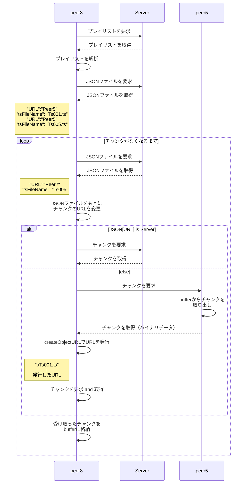

```mermaid
sequenceDiagram
		peer8->>Server: プレイリストを要求
		Server-->>peer8: プレイリストを取得
		peer8->>peer8: プレイリストを解析
		peer8->>Server: JSONファイルを要求
		Server-->>peer8: JSONファイルを取得
		Note left of peer8 : "URL":"Peer5"<br>"tsFileName": "Ts001.ts"<br>"URL":"Peer5"<br>"tsFileName": "Ts005.ts"<br>
		loop チャンクがなくなるまで
		peer8->>Server: JSONファイルを要求
		Server-->>peer8: JSONファイルを取得
		Note left of peer8 : "URL":"Peer2"<br>"tsFileName": "Ts005.
		peer8->>peer8: JSONファイルをもとに<br>チャンクのURLを変更
		alt JSON[URL] is Server
		peer8->>Server: チャンクを要求
		Server-->>peer8: チャンクを取得
		else else
		peer8->>peer5: チャンクを要求
		peer5->>peer5: bufferからチャンクを<br>取り出し
		peer5-->>peer8: チャンクを取得（バイナリデータ）
		peer8->>peer8: createObjectURLでURLを発行
		Note left of peer8 : "./Ts001.ts"<br>↓<br>発行したURL
		peer8->>peer8: チャンクを要求 and 取得
		end
		peer8->>peer8: 受け取ったチャンクを<br>bufferに格納
		end
```